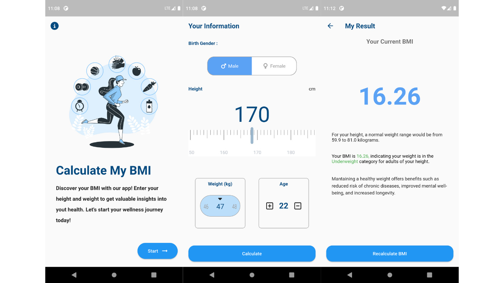

# bmicheck

BMICheck is an app to calculate your Body Mass Index made with flutter.

## Technologies

- Flutter built-in Navigator
- Stateful Widgets
- Design References from [Rim Ayed - Behance](https://www.behance.net/gallery/175522875/BMI-calculator-App-UI-Design)

## Screenshots

## Contributing

Feel free to create a pull request and provide a clear description of the changes.
